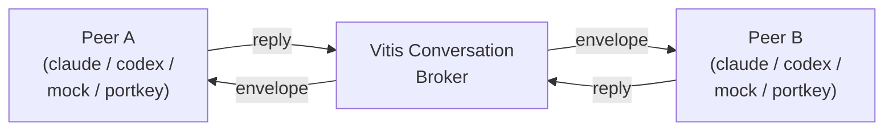

# Vitis Documentation

**Vitis** is a local-first orchestrator for driving AI agent CLIs (Claude Code, Codex, …) through a real PTY. It started as a single-prompt-and-extract harness and has grown into a multi-turn agent-to-agent (A2A) broker with pluggable token-efficiency layers.

> The full README — installation, quick start, feature flag table, dependency stack, project tree, and design philosophy — lives in the [repository root](https://github.com/kamilandrzejrybacki-inc/vitis/blob/main/README.md). This site reproduces the canonical specs, plans, and review reports for browsing.

## What's in this site

| Section | Contents |
|---|---|
| **[Specs](superpowers/specs/2026-04-07-vitis-a2a-conversations-design.md)** | Canonical design specs for the A2A conversation system, the v1 agent bridge, and the PTY runtime |
| **[Plans](superpowers/plans/2026-04-07-a2a-plan-1-foundation.md)** | Implementation plans, executed via subagent-driven development |
| **[Reviews](superpowers/reviews/2026-04-07-a2a-review-findings.md)** | Consolidated findings from the parallel review passes (backend, golang-patterns, golang-testing, security, codex) |

## Quick orientation

Vitis sits between two long-lived AI agent CLIs and routes turn-by-turn messages between them through a real PTY. The broker handles strict alternation, marker-token injection for turn-end detection, sentinel/judge termination, file-store persistence, and an event bus that's pluggable from in-process channels (default) to NATS (planned).

## Where to start

| If you want to… | Read this |
|---|---|
| Get a working `vitis converse` against real LLMs in 5 minutes | The [README quick start](https://github.com/kamilandrzejrybacki-inc/vitis/blob/main/README.md#quick-start) |
| Understand the A2A protocol design | [A2A Conversations spec](superpowers/specs/2026-04-07-vitis-a2a-conversations-design.md) |
| See how the foundation packages were built | [A2A Plan 1 — Foundation](superpowers/plans/2026-04-07-a2a-plan-1-foundation.md) |
| See how the PTY runtime + CLI were wired | [A2A Plan 2 — PTY + CLI](superpowers/plans/2026-04-07-a2a-plan-2-pty-cli.md) |
| Understand what review passes caught and how they were fixed | [A2A Review Findings](superpowers/reviews/2026-04-07-a2a-review-findings.md) |
| Run the manual test suite | [tests/manual/README.md](https://github.com/kamilandrzejrybacki-inc/vitis/blob/main/tests/manual/README.md) |
